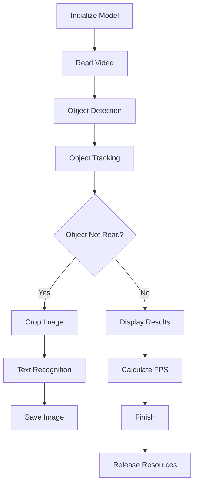
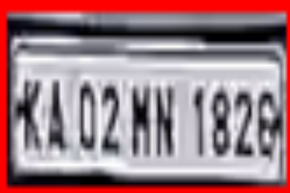

# License Plate Recognition System

## Objective
This system is designed to recognize and track license plates in videos. It utilizes technologies such as YOLO for object detection and PaddleOCR for text recognition.

## Workflow

The system operates through the following steps:

1. **Initialize Model**: 
   - Load the pre-trained YOLO model to detect license plates.
   - Initialize OCR to recognize text from images.

2. **Read Video**: 
   - Open the video from the specified path and read each frame.

3. **Object Detection**: 
   - Use the YOLO model to detect objects in the frame.
   - Store the coordinates of the bounding boxes for detected objects.

4. **Object Tracking**: 
   - Use the SORT algorithm to track objects across frames.
   - Update the status of objects over time.

5. **Text Recognition**: 
   - If an object has not been read, crop the image from the bounding box and use OCR to recognize the text.
   - Save the license plate image to the specified directory.

6. **Display Results**: 
   - Display the video frame with bounding boxes and recognized text.
   - Calculate and display FPS (Frames Per Second).

7. **Finish**: 
   - When the video has been processed or the user presses 'q', release resources and close the display window.

## Flowchart


### Requirements
- Python 3.x
- OpenCV
- Ultralytics YOLO
- PaddleOCR
- NumPy
- Matplotlib

### Install Library
```bash
pip install opencv-python ultralytics paddleocr numpy matplotlib
```

### Run System
1. Ensure you have the `license_plate_detector.pt` model in the working directory.
2. Run the `main.py` file to start recognizing license plates from video.

```bash
python main.py
```
## Results

Here is an example of a saved license plate image:



## Notes
- The system can be customized to work with different types of license plates by retraining the YOLO model with new data.
- Ensure the input video has good quality to improve recognition accuracy.

## MIT License

Copyright (c) 2025 [BaoHan1712]
